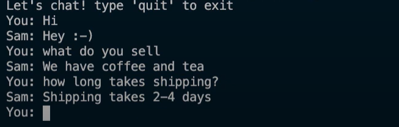

# Mini-Project--Application-of-NN

## Project Title: Chat BOT
## Project Description:
* This bot is created by using neural networks for the purpose of selling products. 
* This bot take orders from the user and inform the details to the seller.
* It is a very user-friendly bot and can be playful at sometimes.
* And ofcourse this is not the complete project but this is the protype of the bigger picture.
* It is created by using NLP and deep learning techniques.
## Algorithm:
1. Create a python environment.
2. Create a json files and feed the expected user chat patterns and appropriate respones under a tag.
3. Create a library for tokenizing the words, stemming the words and creating bag of words which shows the sentence in 1 and 0 array.
4. Create a python file to train the json file using neural network techniques for the bot and create a model file to fit the layers.
5. Save the trained python file.
6. Using that save file initiate chat by creating another py thon file.
7. Chat with the bot.
## Program:
### JSON file:
```
# intents.json
{
    "intents": [{
            "tag": "greeting",
            "patterns": [
                "Hi",
                "Hey",
                "How are you",
                "Is anyone there?",
                "Hello",
                "Good day"
            ],
            "responses": [
                "Hey :-)",
                "Hello, thanks for visiting",
                "Hi there, what can I do for you?",
                "Hi there, how can I help?"
            ]
        },
        {
            "tag": "goodbye",
            "patterns": ["Bye", "See you later", "Goodbye"],
            "responses": [
                "See you later, thanks for visiting",
                "Have a nice day",
                "Bye! Come back again soon."
            ]
        },
        {
            "tag": "thanks",
            "patterns": ["Thanks", "Thank you"],
            "responses": ["Happy to help", "Anytime", "See ya!"]
        },
        {
            "tag": "items",
            "patterns": ["What kinds of items are there?",
                "Which item do you have?",
                "What do you sell?"
            ],
            "responses": ["We sell coffee and tea",
                "We have coffee and tea"
            ]
        },
        {
            "tag": "payments",
            "patterns": ["Do you take credit cards?",
                "Can I pay with Paypal?",
                "Is COD available?"
            ],
            "responses": [
                "We accept VISA, Mastercard and Paypal",
                "We accept most major credit cards, and Paypal"
            ]
        },
        {
            "tag": "delivery",
            "patterns": [
                "How long does deliver take?",
                "When can i get my hands on the product?",
                "How long does shipping take?"
            ],
            "responses": [
                "Delivery takes 2-4 days",
                "About 2-4 days be patient"
            ]
        },
        {
            "tag": "funny",
            "patterns": [
                "Tell me about you",
                "Do you know a joke?"
            ],
            "responses": [
                "You are a joke!!"
            ]
        }
    ]
}
```
### Library file:
```
# nltk_utlis.py
import nltk
import numpy as np
nltk.download('punkt')
from nltk.stem.porter import PorterStemmer
stemmer=PorterStemmer()
def tokenize(sentence):
    return nltk.word_tokenize(sentence)

def stem(word):
    return stemmer.stem(word.lower())

def bag_of_words(tokenized_sentence,all_words):
    tokenized_sentence=[stem(w) for w in tokenized_sentence]
    bag=np.zeros(len(all_words),dtype=np.float32)

    for idx,w in enumerate(all_words):
        if w in tokenized_sentence:
            bag[idx]=1.0
    return bag
```
### Model file:
```
# model.py
import torch
import torch.nn as nn

class NeuralNet(nn.Module):
    def __init__(self,input_size,hidden_size,num_classes):
        super(NeuralNet,self).__init__()
        self.l1=nn.Linear(input_size,hidden_size)
        self.l2=nn.Linear(hidden_size,hidden_size)
        self.l3=nn.Linear(hidden_size,num_classes)
        self.relu=nn.ReLU()
    def forward(self, x):
        out=self.l1(x)
        out=self.relu(out)
        out=self.l2(out)
        out=self.relu(out)
        out=self.l3(out)
        return out
```
### Training file:
```
# train.py
import json
from nltk_utils import tokenize, stem, bag_of_words
import numpy as np
import torch
import torch.nn as nn
from torch.utils.data import Dataset, DataLoader
from model import NeuralNet
with open('intents.json','r') as f:
    intents=json.load(f)
all_words=[]
tags =[]
xy=[]
for intent in intents['intents']:
    tag=intent['tag']
    tags.append(tag)
    for pattern in intent['patterns']:
        w=tokenize(pattern)
        all_words.extend(w)
        xy.append((w,tag))

ignore_words=['?','!',',','.']
all_words=[stem(w) for w in all_words if w not in ignore_words]
all_words=sorted(set(all_words))
tags=sorted(set(tags))

x_train=[]
y_train=[]

for(pattern_sentence, tag) in xy:
    bag=bag_of_words(pattern_sentence,all_words)
    x_train.append(bag)

    label=tags.index(tag)
    y_train.append(label)

x_train=np.array(x_train)
y_train=np.array(y_train)

class ChatDataset(Dataset):
    def __init__(self):
        self.n_samples=len(x_train)
        self.x_data=x_train
        self.y_data=y_train

    #dataset[idx]
    def __getitem__(self, index):
        return self.x_data[index], self.y_data[index]
    
    def __len__(self):
        return self.n_samples


# Hyperparameters
batch_size=8
hidden_size=8
output_size=len(tags)
input_size=len(x_train[0])
learning_rate=0.001
num_epochs=1000
dataset=ChatDataset()
train_loader=DataLoader(dataset=dataset, batch_size=batch_size,shuffle=True,num_workers=2)

device=torch.device('cuda' if torch.cuda.is_available() else 'cpu')
model=NeuralNet(input_size,hidden_size,output_size).to(device)


criterion=nn.CrossEntropyLoss()
optimizer=torch.optim.Adam(model.parameters(),lr=learning_rate)
for epoch in range(num_epochs):
    for (words, labels) in train_loader:
        words=words.to(device)
        labels=labels.to(device)

        outputs=model(words)
        loss = criterion(outputs,labels)

        optimizer.zero_grad()
        loss.backward()
        optimizer.step()

    if(epoch+1) % 100==0:
        print(f'epoch {epoch+1}/{num_epochs},loss={loss.item():.4f}')
print(f'final loss, loss={loss.item():.4f}')

data ={
    "model_state":model.state_dict(),
    "input_size":input_size,
    "output_size":output_size,
    "hidden_size":hidden_size,
    "all_words":all_words,
    "tags":tags
}

FILE="data.pth"
torch.save(data,FILE)
print(f'training complete. filse saved to {FILE}')
```
### Chat initiation:
```
# chat.py
import random
import json
import torch
from model import NeuralNet
from nltk_utils import bag_of_words, tokenize
device=torch.device('cuda' if torch.cuda.is_available() else 'cpu')
with open('intents.json','r')as f:
    intents=json.load(f)
FILE="data.pth"
data=torch.load(FILE)
input_size=data["input_size"]
hidden_size=data["hidden_size"]
output_size=data["output_size"]
all_words=data["all_words"]
tags=data["tags"]
model_state=data["model_state"]
model=NeuralNet(input_size,hidden_size,output_size).to(device)
model.load_state_dict(model_state)
model.eval()
bot_name="Sam"
print("Let's chat! type 'quit' to exit")
while True:
    sentence= input('You: ')
    if sentence=="quit":
        break

    sentence=tokenize(sentence)
    X=bag_of_words(sentence,all_words)
    X=X.reshape(1,X.shape[0])
    X=torch.from_numpy(X)

    output=model(X)
    _, predicted=torch.max(output,dim=1)
    tag=tags[predicted.item()]

    probs=torch.softmax(output,dim=1)
    prob=probs[0][predicted.item()]
    if prob.item()>0.75:
        for intent in intents["intents"]:
            if tag==intent["tag"]:
                print(f"{bot_name}: {random.choice(intent['responses'])}")
            else:
                print(f'{bot_name}: I do not understand...')
```
## Output:



## Advantage :
* This bot is easy to use.
* It will reduce the burden of seller.
* The response in much faster.
* Profit can be increased.
## Result:
Thus, a chat bot has been successfully created using neural networks.
<h2 align="right">Project By:</h2
<h3 align="right">Nithishkumar P - 212221230070</h3>
